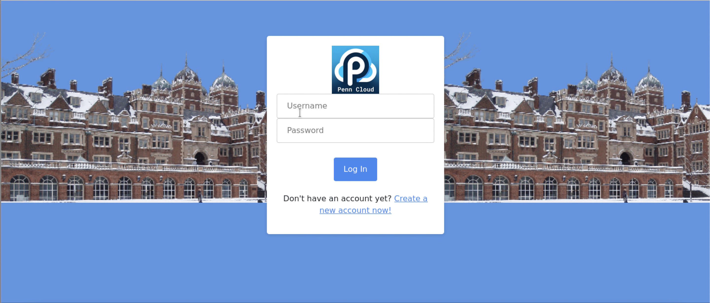
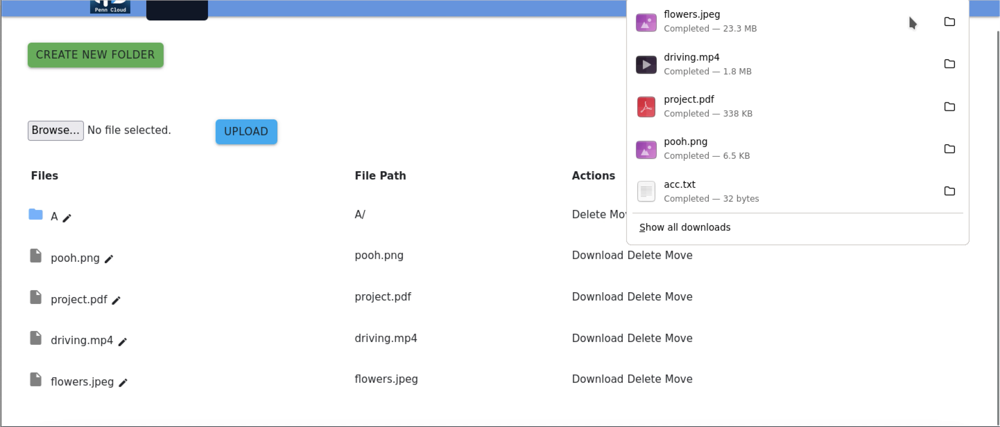
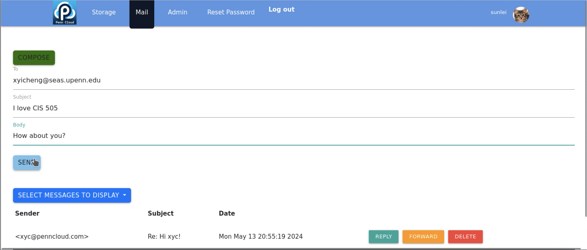
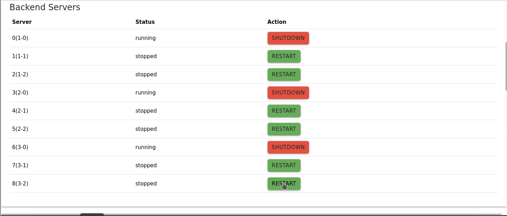

# PennCloud

## Demo

We provide a [demo video](https://www.youtube.com/watch?v=4uSrdlRKoJA) to fully show the primary features of our project.

Sample screenshots are shown below:

### Home Page


### Sign Up


### Storage


### Webmail


### Admin Console


## Setup

This project utilizes gRPC with Bazel. To install Bazel, please follow the instructions [here](https://bazel.build/install).

To build the project, run
```bash
bazel build "..."
```
if you are using zsh. Otherwise, run

```bash
bazel build ...
```
instead. It will build the project and generate the necessary files in a few minutes.

## Minimal Solution

To test the KV store, run with a minimal solution with one primary and one secondary node by calling both the server and the coordinator with the following commands:
```bash
bazel-bin/src/kv_server config_test.txt &
bazel-bin/src/kv_coordinator data/storage_10.bin data/log_10.bin config_test.txt 1 0 &
bazel-bin/src/kv_coordinator data/storage_11.bin data/log_11.bin config_test.txt 1 1 &
 &
```

For the rest part, see the following instructions.

## Full System

### Storage

To run the full system, use the following commands to start the server and the coordinator with $3\times 3$ storage nodes:
```bash
bazel-bin/src/kv_server config.txt &
bazel-bin/src/kv_coordinator data/storage_10.bin data/log_10.bin config.txt 1 0 &
bazel-bin/src/kv_coordinator data/storage_11.bin data/log_11.bin config.txt 1 1 &
bazel-bin/src/kv_coordinator data/storage_12.bin data/log_12.bin config.txt 1 2 &
bazel-bin/src/kv_coordinator data/storage_20.bin data/log_20.bin config.txt 2 0 &
bazel-bin/src/kv_coordinator data/storage_21.bin data/log_21.bin config.txt 2 1 &
bazel-bin/src/kv_coordinator data/storage_22.bin data/log_22.bin config.txt 2 2 &
bazel-bin/src/kv_coordinator data/storage_30.bin data/log_30.bin config.txt 3 0 &
bazel-bin/src/kv_coordinator data/storage_31.bin data/log_31.bin config.txt 3 1 &
bazel-bin/src/kv_coordinator data/storage_32.bin data/log_32.bin config.txt 3 2 &
 &
```

### Webmail
```bash
bazel-bin/src/webmail/mailserver -v
```

### Frontend

Run in different terminals to set different ports.

```bash
bazel-bin/src/frontend_servers/frontend_server 8080
```
```bash
bazel-bin/src/frontend_servers/frontend_server 8081
```
```bash
bazel-bin/src/frontend_servers/frontend_server 8082
```

### Load Balancer
```bash
bazel-bin/src/frontend_servers/load_balancer
```

### Admin
```bash
bazel-bin/src/frontend_servers/admin_console_server feconfig.txt
```

### Enter the System

Open your browser and enter `localhost:8090` to access the system,
which will direct you to one of the active frontend servers;
or enter `localhost:8888` to access the admin console.
